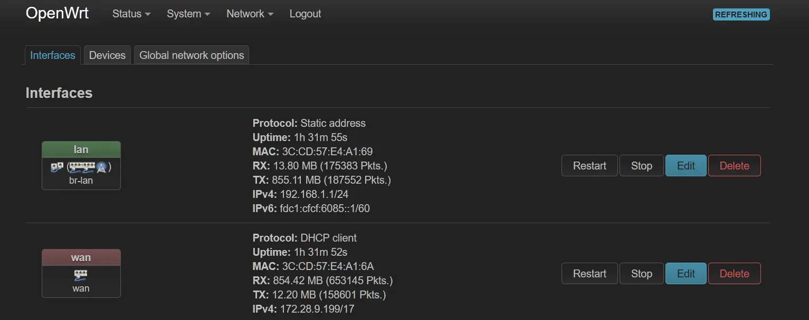

很有必要在宿舍使用路由器。这边的网络是**每个学生向运营商办一份校园宽带，由管理员将其同学生账号绑定**後才可使用校园网。电信的宽带起步都59了，只是为了用个网就要交那么多月租，很不划算的。<br>
所以使用路由器的话，和其他同学合租一个套餐，就能省下不少月租的开销😋。

本篇记录我在折腾路由器时遇到的问题和解决方法 ~~和我愚蠢的思路~~。

****
## 🚩路由器
校园网的方案是每个宿舍设置一台光猫，有线网络连网线；无线信号由光猫发射，都是2.4GHz的。<br>
学校说是禁止使用路由器，後来又更新了规定说是不推荐使用路由器，现在这两条规定自相矛盾地共存着。而且似乎也没说有什么违规惩罚，只有**可能会出现网络频繁掉线或重新登陆或被封禁5分钟的情况**。

家里有空闲的路由器能用，不过我还是买了个。因为当时既没有所需的工具，更因为我太菜了根本不会线刷路由器😭。

### 参数
来源：[OpenWrt Techdata](https://openwrt.org/toh/hwdata/xiaomi/xiaomi_mi_router_4a_gbit)
|||
:-:|:-:
型号 | 	Xiaomi Mi Router 4A Gigabit Edition
平台 | 	ramips/mt7621
CPU | MediaTek MT7621A<br>mipsel_24kc<br>2 cores@880MHz
内存 | 128Mb
闪存 | 16Mb
接口 | 1x WAN<br>2x LAN<br>只有这三个😨

我就是图方便买个小米的，确实方便，但是到手的可用存储就剩8.31Mb，想装点东西，前置依赖都差不多把地方占满了，也没有usb接口来扩容，下次买个大的吧😇。

## 💿操作系统
### OpenWrt
OpenWrt是一个基于Linux的针对嵌入式设备和路由器的操作系统。也有很多衍生自OpenWrit的或第三方的操作系统，但我这算是第一次正经使用嵌入式设备，用经典的。<br>
要问为什么要刷软路由，因为硬路由出厂自带的系统扩展性还不够，我还要折腾其他的东西。

### 刷入固件
> ❗此方法仅适用于该型号，仅供参考，其他设备去[OpenWrt官方文档](https://openwrt.org/toh/start)找适用的方法

开源项目[OpenWRTInvasion](https://github.com/acecilia/OpenWRTInvasion/)，能让部分小米路由器不用拆机器就能刷。

### 准备
- 一台电脑
- **Windows功能**启用
    - `Telnet客户端`
    - `TFTP客户端`
- 一根网线，连接路由器与电脑
- Git
- Python3
- OpenWrt固件

### 开刷
> OpenWRTInvasion的README说**使用windows可能会遇上兼容性问题**。我遇上了，但最终莫名其妙成功了🤪
1. 克隆仓库至本地
    ```bash
    git clone https://github.com/acecilia/OpenWRTInvasion.git
    cd OpenWRTInvasion/
    ```
2. 直接使用`Git Bash`的命令行环境
    ```bash
    pip install -r requirements.txt 
    python remote_command_execution_vulnerability.py
    ```
3. 脚本运行，
    - 请求输入路由器地址，小米路由器默认为`192.168.31.1`；

    - 可能请求输入stok，访问路由器的管理页面，url中会有`.../stok=xxxxxxxxxxxx/...`的字样，复制那一串即可；

    - 选择脚本工作的方式，第二种**须有网而且能访问Github**;<br>
    > ❓如果到此出现了`Warning: the process has finished, but seems like ssh connection to the router is not working as expected.`那应该就是遇上兼容性问题了，我的办法是先刷个[官方稳定版ROM](http://www1.miwifi.com/miwifi_download.html)，再运行一遍脚本，莫名其妙就得了🤪
4. 等待脚本成功完成，会输出以下内容：
    ```txt
    done! Now you can connect to the router using several options: (user: root, password: root)
    * telnet 192.168.1.1
    * ssh -oKexAlgorithms=+diffie-hellman-group1-sha1 -oHostKeyAlgorithms=+ssh-rsa -c 3des-cbc -o UserKnownHostsFile=/dev/null root@192.168.1.1
    * ftp: using a program like cyberduck
    ```
5. 任选一种方法来连接路由器，我是直接在Windows资源管理器中使用ftp协议连接；
6. 将固件移到`/tmp`文件夹中；
7. 写入固件，等待完成：
    ```bash
    mtd -e OS1 -r write <固件> OS1
    ```

### 变成砖头了
刷OpenWrt之前我手贱试着刷个国际版miwifi固件，路由器开始疯狂闪橙灯😭。

解决办法：
- 如果还有反应，按照[小米官方救砖工具](http://www1.miwifi.com/miwifi_download.html)的指示进行救砖即可，一定要关掉防火墙不然无法正常使用；<br>
- 如果已经没反应了……要不还是买个新的吧😇。

## 📡网络配置
这一部分走的弯路最多。<br>
我最开始是连接为主路由，wifi用不得就以为这样不行，又尝试旁路由，路由器又连不上网了，绕到最後才知道wifi在`Interfaces`里面要选择lan接口才对，其实最开始的主路由就是正确的，我是白痴😭。

### 网线连接
示意图：
```txt
LAN 光猫
 │
WAN 路由器
 │
所有用网设备
```
我这里桌子底下的网口就是来自光猫LAN口的，直接插路由器WAN口就得，就这么简单的😥。

### 接口配置
1. 到`Network/Interfaces`面板中；

2. `Edit`接口wan，确保**Protocol**为DHCP Client；
3. `Edit`接口lan，设置**Protocol**为Stastic address；
> ❗此处设置的地址是访问路由器的，如果没设置好导致访问不到路由器了，那就要reset了嗷😈

### 无线网络
1. 登录OpenWrt的管理页面，默认为`192.168.1.1`；
2. 到`Network/Wireless`面板中：


> `radio`是无线发射器，具体型号的参数去对应官网找找<br>`Scan`用于探测和连接wifi，可用于网络桥接等等

3. `Add`配置一个新的无线信号，
> ❗只配置必要的内容，看不懂就不要乱改了
4. 在`Device Configuration`中调整**Operating frequency**，还有`Advanced Settings`标签中的**Country Code**，务必设置，不然发射器不能正常启动；
5. 在`Interface Configuration`中设置**Mode**选择Access Point，**Network**选择lan，**ESSID**和`Wireless Security`标签中的wifi加密；

### 网络认证
直接在电脑上访问学校的网络认证界面，输入认证信息就得。<br>
而我最开始以为电脑访问的只是电脑的认证，其他设备可能没认证，我还想怎么能在路由器访问认证页面并转发给电脑，其实用电脑访问的就是路由器的认证啊我想那么多做什么，搞了那么久，白痴啊我😭。


## 📦应用配置
### 英文看不懂啦
当然是有官方中文的，只是没预装：
> 约占用**50Kb**
1. 到`System/Software`面板中；
2. 点击`Update lists...`等待完成；
3. `Filter`搜索**luci-i18n-base-zh-cn**
然後`install`等待完成；
4. 到`System/System/`面板中，`Language and Style`标签中切换语言。


### Luci主题
> 约占用**500Kb**<br>

[luci-theme-argon](https://github.com/jerrykuku/luci-theme-argon/)有很优雅的现代图形界面，适配很多实用的插件，按照项目的README指示就得

****

## 参考资料
[Installing OpenWrt on the Xiaomi 4A, 4C, 3Gv2, 4Q, miWifi 3C and debrick method New 2022 - YouTube](https://www.youtube.com/watch?v=SLbkce-M2nE)

[OpenWRT软件仓库镜像使用帮助 - MirrorZ](https://help.mirrors.cernet.edu.cn/openwrt/)

[路由器自动登录校园网 - bilibili](https://www.bilibili.com/video/BV1FA411N73f)