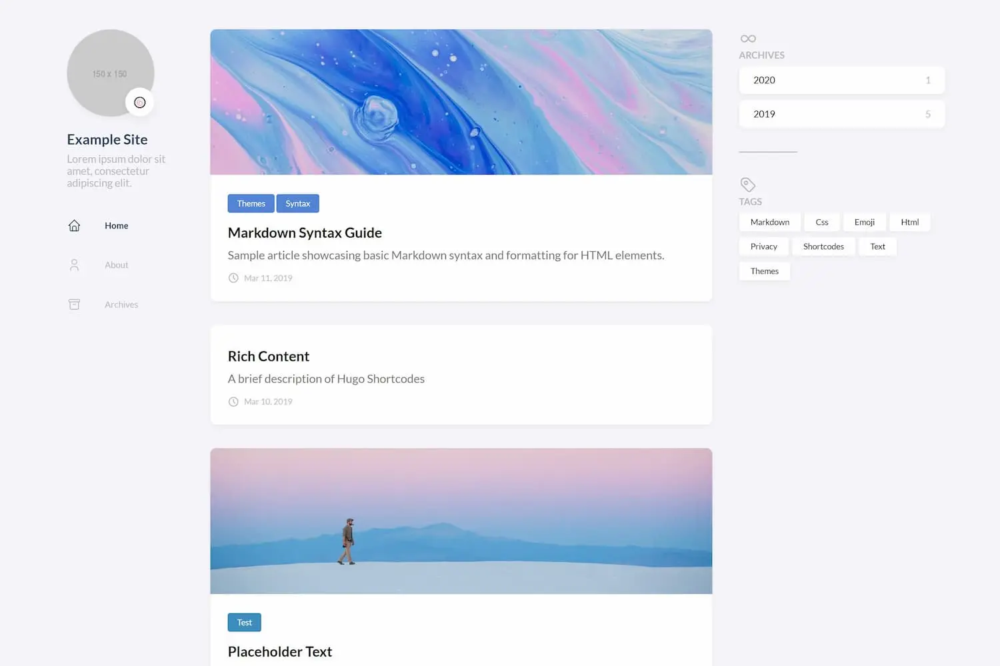
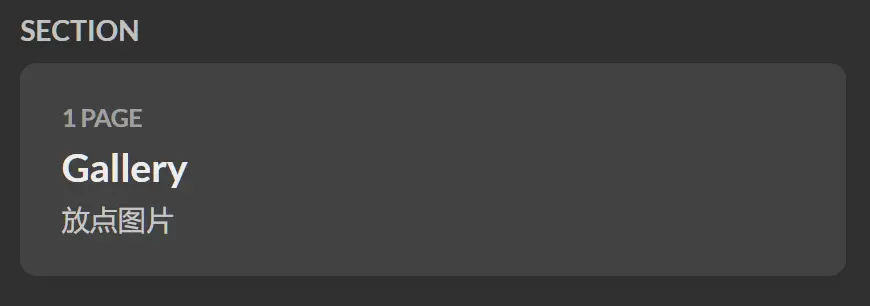

hugo是我用的第一个静态网页框架。
之前打算用python为主的web框架，但我的知识储量……完全不够！而hugo的本体仅仅一个`exe`，怎么想都更简单更方便吧🤩。

本篇记录我在探索Hugo的基本的搭建流程以及遇到的各种问题。

****
## 🎈安装hugo
hugo有两个版本，*standard*和*extended*。*extended*自带scss转译器，hugo的主題多是用scss的，所以最好直接用*extended*，不然主题都用不得。

hugo提供很多安装方式，我还没有用包管理器的习惯，所以直接到[releases](https://github.com/gohugoio/hugo/releases)下载。

## 🎨使用主题
hugo的[官方的主题列表](https://themes.gohugo.io/)，提供几百种主题可选；

这里用的是[@CaiJimmy](https://github.com/CaiJimmy)大佬的[hugo-theme-stack](https://github.com/CaiJimmy/hugo-theme-stack)主题，简洁大方🥰：


> stack提供了一个[快速模板](https://github.com/CaiJimmy/hugo-theme-stack-starter)，同[标准仓库](https://github.com/CaiJimmy/hugo-theme-stack)一样的使用方法，里面有最基本的内容管理结构，可以更快速地理解hugo的[内容管理](#📄内容管理)，以及我用这个仓库遇到的莫名其妙的问题更少。

然而主题是我搞得**最久**的部分**之一**，
stack有[文档](https://stack.jimmycai.com/guide/)，不过写的不算通俗易懂，不适合刚接触hugo的新手，比如我😢，我看着这些模模糊糊的描述，又对着hugo的文档横竖看了好几日才大概理解那些个参数。

### 安装主题
hugo主题有*git submodule*和*hugo module*两种安装方法。
前者需要把仓库克隆到网站的`themes`文件夹里；
後者只需要在配置文件里多加一两行即可，首次hugo server会自动下载并应用主题。

~~还有一个手动下载仓库放到themes里的方法，我说何必呢~~

如果不想对主题作修改，*hugo module*会省心一点。但是要改的话，就要到项目仓库里复制要改的文件，然後以相同的目录结构，放在网站的`layouts`文件夹中。还有一件事，stack如果有重大更新要手动在stack里改一下版本号。

*git submodule*把仓库都弄来了，所以既可以复制一份放到`layouts`去改，也可以直接改动主题的文件。
❗ 但是，stack的仓库不允许直接commit和push，所以需要fork过来自用，然後把submodule的url改成fork的地址，这样才能安心地修改主题。

我用的*hugo module*，因为我实在懒得解决使用*git submodule*造成的主题没生效而导致Page Not Found😵。

## 📄内容管理
内容管理是hugo的核心内容最多的部分。不可能用这么短的篇幅介绍完的（挖坑）。<br>
目前就只是能把网站跑起来的阶段，也就理解了皮毛，更深的我不会🤓。

### page bundle
搞得**最久**的部分**之二**，难点主要是hugo的页面组织结构：***page bundle***，分为*leaf bundle*和*branch bundle*。

> page bundle用来更有序地组织有关联的内容，比如可以把一篇博客用到的图片或文档之类的资源，统放到一个文件夹内。
> 否则就要把资源文件都往`static`或`assets`文件夹放，内容多起来就不易管理了。

#### **leaf bundle**
*leaf bundle*的主角是名为`single`的单页，只需要在一个文件夹里放一个`index.md`即可形成。
这种结构没有子级，不管有多少个子级文件夹，所有资源都是同级的。
以本篇的结构举例：
```txt
post
└── use-hugo
    ├── index.md
    ├── cover.webp
    └── screenshot.webp

# 文章主体写在index.md里，
# 图片通过markdown来链接
```

还有一个配合*leaf bundle*的*headless bundle*，目前不会用🤓。

#### **branch bundle**

*branch bundle*是树状结构，能创建一个囊括许多单页的`list`。一个文件夹放一个且只能一个`_index.md`来形成这种结构，所有资源都在同一文件夹中。*leaf bundle*不可嵌套，而该结构可嵌套任意层。

在stack主题中，可以在`_index.md`的frontmatter写一个分区的头标签：
```yaml
---
title: "Gallery"
description: "放点图片"
---
```
对应分区的顶部就会展现出来：


> stack主题就是利用branch bundle和frontmatter来渲染侧边栏的分区，具体参阅[stack的文档](https://stack.jimmycai.com/config/menu)。

这种结构好像不用来写文章，应该是用于整理不同分区类型的，总之我还不会用🤓。

## 📤部署网站
### Hugo Build
直接用hugo自己的部署方式，这种方式简单。在命令行直接`hugo`，hugo会渲染出静态网页，放到`public`文件夹，然後直接把该文件夹推至远程仓库即可，不需要什么改动了。

### Github Actions
> ❗ [快速模板](#安装主题)有自带的workflow，然而该模板其实是使用docker在`github codespace`里部署的，里面的workflow不适用于Github Actions，所以要自行弄一个workflow。

根据[hugo文档提供的部署方法](https://gohugo.io/hosting-and-deployment/hosting-on-github/)，照着步骤做就行。

或者到自己的远程仓库页面，在Actions面板点击`New workflow`，使用github提供的模板，修改分支名和版本号即可。保存至`/.github/workflows/`目录下，
以後每次push到远程仓库，workflow都会开始工作，将源码渲染成静态网页，只需等待部署完成。

> 以上两种方法不出意外的话效果都一样的，只不过前者的源码没在仓库里。


## 🎉收尾
暂时先这么多，还有很多核心功能我都还没怎么摸过：`shortcodes`，`templates`，`i18n`，`archetypes`...

等我回去再看一段时间😭🌹。

****
## changelog
|||
|:-:|:--|
|2023 \| 09-27|#1:略微修改|
|Oringin|#0:Oringin|
